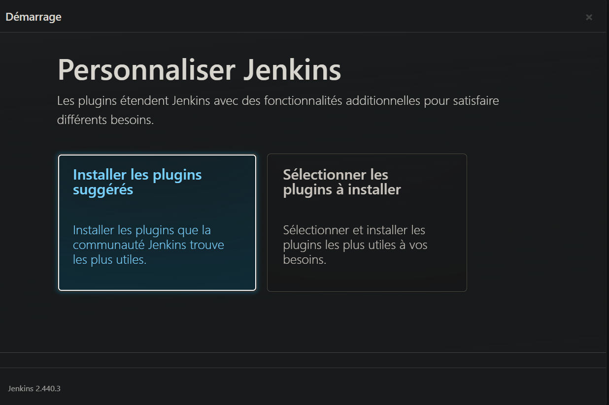
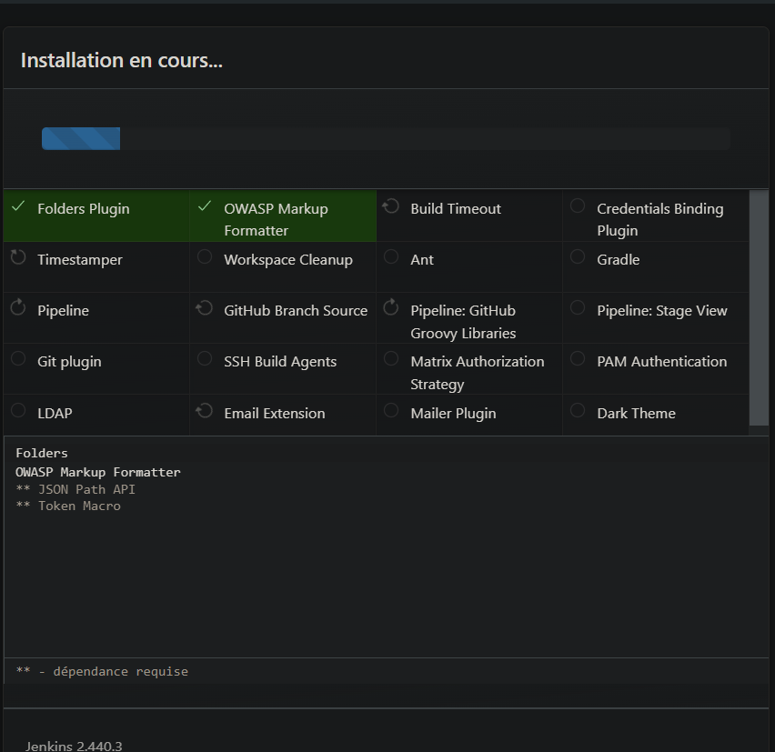
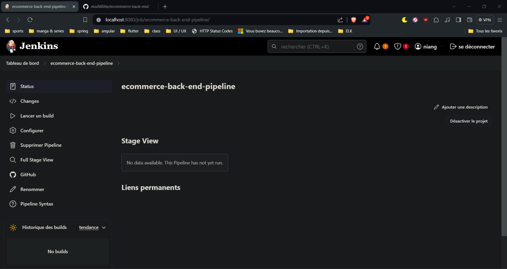
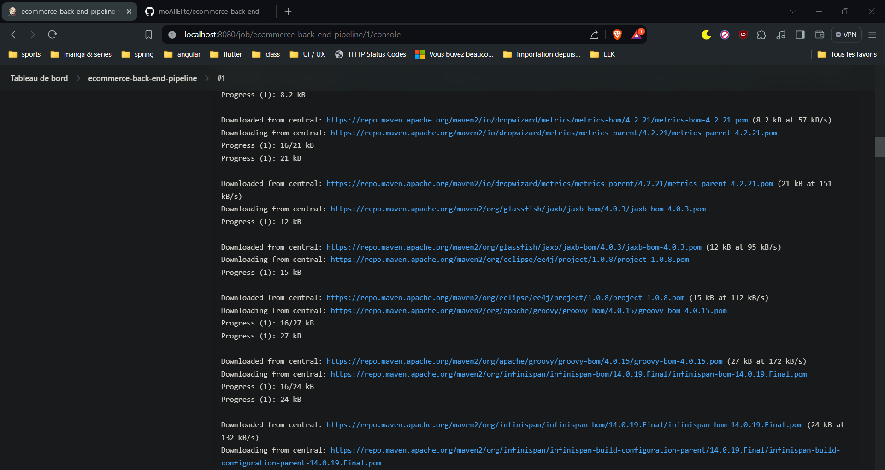
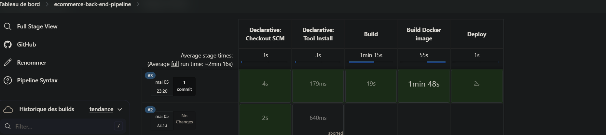
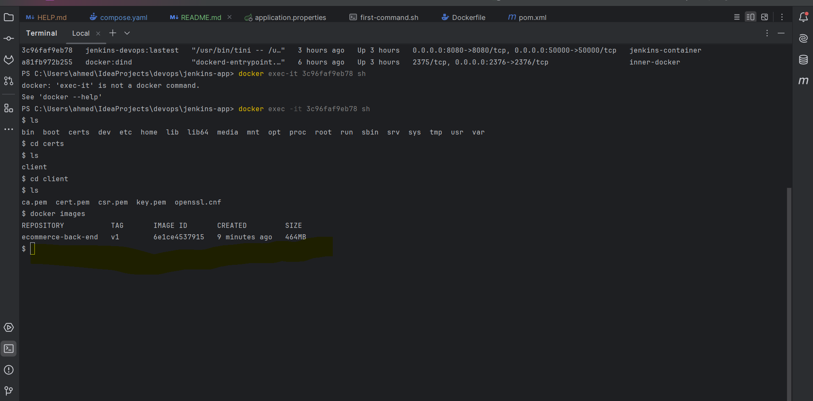

# JENKINS 
The jenkins is running on `localhost:8080`
Neither creating a network with cmd `docker create network jenkins`
we use our docker-compose in order this one. 
to create 
## 1. Docker commands

### Excecute docker compose container in detach
    docker-compose up -d

### Show running processus
    docker ps
### Show Volume's list
    docker volume ls
### Show the list of docker's container 
    docker container ls

### Show logs
    docker logs <id_container>
## 2.Install Jenkins on docker

## 3. Pipeline create successfully

### Downloading all dependency from maven central which can take a couple of  minutes

### Job Successfully done 

    
### Execute docker in bash mode
    docker exec -it 3c96faf9eb78  sh 
    
    docker images
